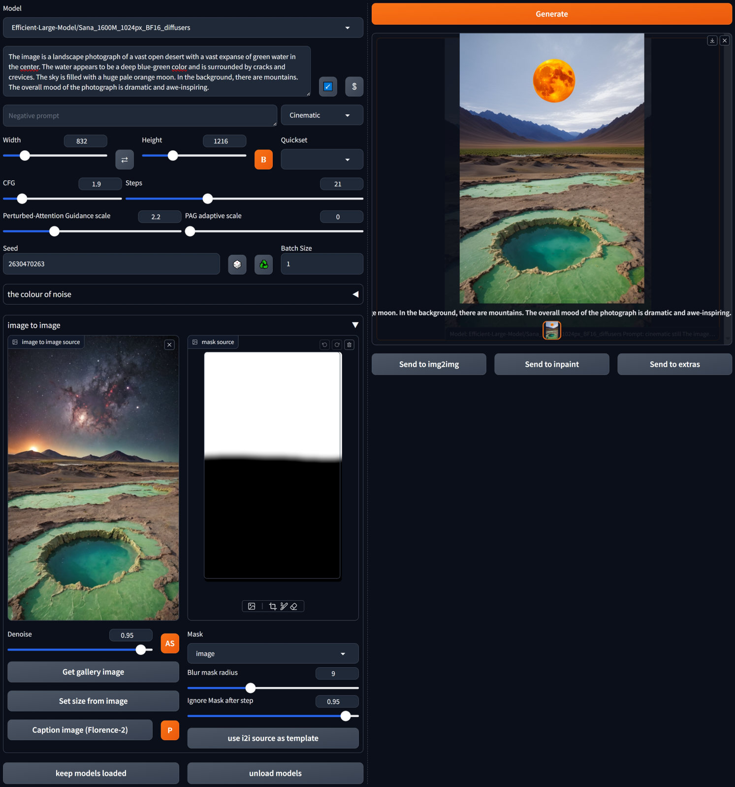

## Sana for webui ##
### only tested with Forge2 ###
I don't think there is anything Forge specific here.


### works for me <sup>TM</sup> on 8GB VRAM, 16GB RAM (GTX1070) ###

---
## Install ##
Go to the **Extensions** tab, then **Install from URL**, use the URL for this repository.
### needs updated *diffusers* ###

Easiest way to ensure necessary versions are installed is to edit `requirements_versions.txt` in the webUI folder.
```
diffusers>=0.32.0
```

---
### downloads models on demand - minimum will be ~15GB ###

---
>[!NOTE]
> if **noUnload** is selected then models are kept in memory; otherwise reloaded for each run. The **unload models** button removes them from memory.

---
### almost current UI screenshot ###



---
<details>
<summary>Change log</summary>

#### 01/01/2025 ####
* add initial sampler selection, not sure how many will work yet. *Euler* and *Heun* need more steps than *DPM++ 2M*.
* add rescale CFG, can be very effective

#### 26/12/2024 ####
* fixes for gallery, sending to i2i

#### 25/12/2024 (2) ####
* add complex human instruction toggle (CHI button), for automatic prompt enhancement.
* avoid unnecessary text encoder load if prompt hasn't changed

#### 25/12/2024 ####
* add control of shift parameter. From initial tests doesn't seem as useful as with Flux or SD3.

#### 24/12/2024 (2) ####
* added PAG and some sort of i2i

#### 24/12/2024 ####
* first implemention. 2K models need ~16GB VRAM for VAE.

</details>


---
example:


